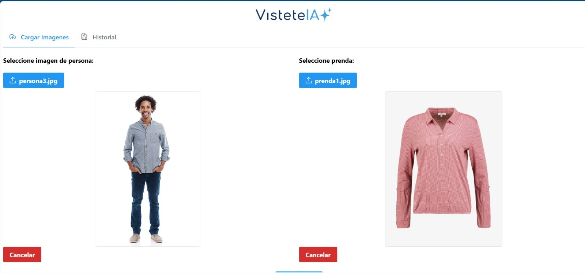
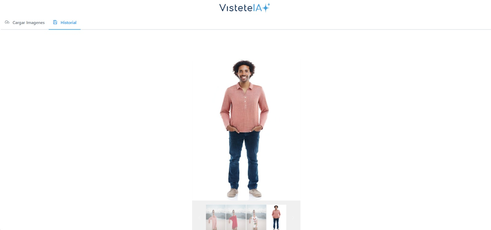

# VisteteIA


## Descripción del Proyecto
Esta aplicación web permite a los usuarios cargar imágenes personales y superponer prendas virtuales utilizando inteligencia artificial. Conectándose a modelos generativos alojados en Hugging Face, la aplicación crea imágenes realistas que simulan cómo se verían las prendas en el usuario.




## Características Principales
- **Generación de imágenes virtuales:** Usa un modelo de difusión para combinar imágenes del usuario y prendas seleccionadas.
- **Interfaz amigable:** Desarrollada con Angular y PrimeNG para una experiencia fluida.
- **Backend robusto:** Implementado con python y FastApi, gestionando peticiones y comunicándose con servicios externos.
- **Conexión con Hugging Face:** Procesamiento de imágenes a través de un modelo generativo alojado en la plataforma.

## Tecnologías Utilizadas
- **Frontend:** Angular 18, PrimeNG, PrimeFlex.
- **Backend:** Python, FastApi.
- **Inteligencia Artificial:** Modelos de difusión en Hugging Face.

## Instalación y Uso
### Requisitos Previos
- Node.js y Angular CLI instalados.
- JDK 11+ instalado.


### Pasos
1. Clona este repositorio:
   ```bash
   git clone https://github.com/MohamadESH/VisteteIA
   ```

2. Configura el backend:
   - Navega al directorio del backend `/API`.
   - Instala las dependencias:
     ```bash
     pip install -r requirements.txt
     ```
3. Añade un token de acceso  en el archivo `/app/main.py`
   - Inicia el backend:
     ```bash
     uvicorn app.main:app --reload
     ```

4. Configura el frontend:
   - Navega al directorio del frontend:
     ```bash
     cd VisteteIA
     ```
   - Instala las dependencias:
     ```bash
     npm install
     ```
   - Inicia el servidor de desarrollo:
     ```bash
     ng serve -o
     ```

5. Abre la aplicación en tu navegador en `http://localhost:4200`.

## Funcionalidades
- Subida de imágenes de usuario.
- Procesamiento de imagenes con IA.
- Visualización de la prenda superpuesta en la imagen del usuario.

## Trabajo Futuro
- **Mejoras en la interfaz:** Diseño más atractivo y funcional.
- **Expansión del catálogo:** Inclusión de más tipos de prendas y estilos.
- **Autenticación de usuarios:** Registro y perfiles personalizados.
- **Procesamiento local:** Despliegue del modelo de IA en servidores propios.

## Contribuciones
Las contribuciones son bienvenidas. Por favor, crea un fork del repositorio y envía un pull request con tus mejoras.

## Licencia
Este proyecto está bajo la Licencia MIT.
